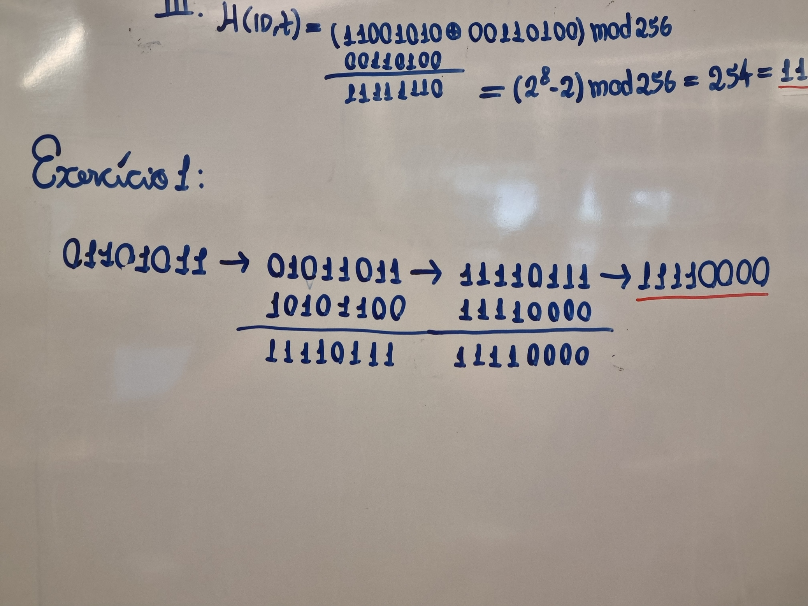
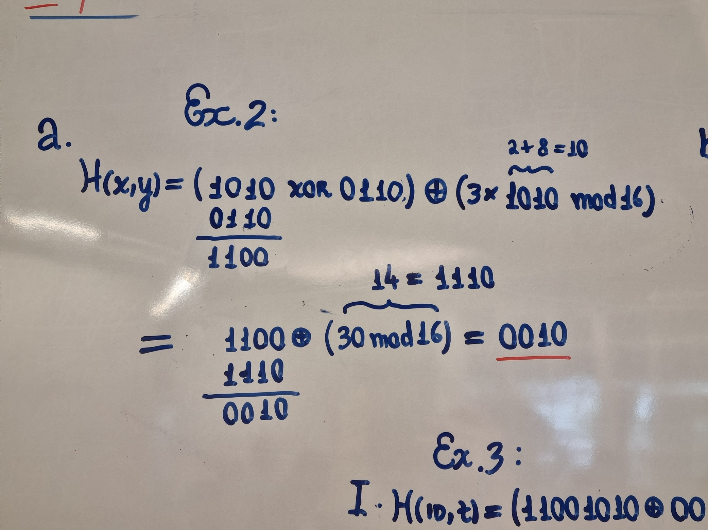
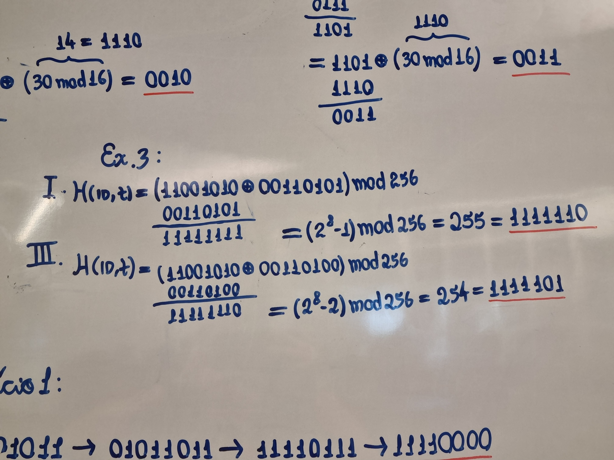

# Ponderada HASH - Semana 08 (Em Sala)

## Exercício 1 — Controle de Integridade de Logs Operacionais

**Cálculos do Hash:**

**Respostas:**

1.  **O hash final:**
    O resultado do hash para o byte inicial (`01101010`) é **11110000**.
    (o resultado final após a máscara AND é o mesmo para ambos).

2.  **Se a alteração de 1 bit em m' = 01101011 resulta em hash diferente:**
    **Não.** O hash resulta no mesmo valor ($11110000$).
    Justificativa: A alteração ocorreu no último bit (bit 0). Após a rotação `RotL3`, esse bit foi para a posição 3. A operação final é um `AND 11110000`, que zera (descarta) os 4 últimos bits (posições 0, 1, 2 e 3). Como a alteração estava em uma região descartada pela máscara, o hash final não mudou (ocorreu uma colisão).

3.  **Qual é a porcentagem de bits alterados no hash final?**
    **0%.** Como o resultado final foi idêntico, nenhum bit foi alterado.

---

## Exercício 2 — Versão de Firmware do CBTC

**Cálculos de H(x,y):**

**Respostas:**

1.  **Calcule H(x,y):**
    Com $x = 1010$ e $y = 0110$, o resultado é **0010**.

2.  **Se um ataque troca apenas o segundo nibble para y’ = 0111, o valor de H muda?**
    **Sim, o valor muda.**
    Com a alteração de $y$ para $0111$, o novo resultado calculado foi **0011**.

---

## Exercício 3 — Detecção de Fraude em Bilhetagem Eletrônica

**Cálculos e Validação:**

**Respostas:**

1.  **Calcule o hash:**
    Para $ID = 11001010$ e $Tempo = 00110101$:
    O resultado é $255$, que em binário é **11111111**.

2.  **O atacante tenta alterar Tempo para 00110100:**
    *(Cálculo realizado na imagem: Novo hash resulta em $254$ ou **11111110**)*.

3.  **O hash permanece igual?**
    **Não.** O hash mudou de $11111111$ para $11111110$.

4.  **Por que esse tipo de "hash fraco" é inseguro?**
    O hash é inseguro porque usa operações lineares simples (XOR e Soma/Módulo) e não tem o "efeito avalanche" (na qual a mudança de 1 bit deveria mudar em média metade dos bits da saída).